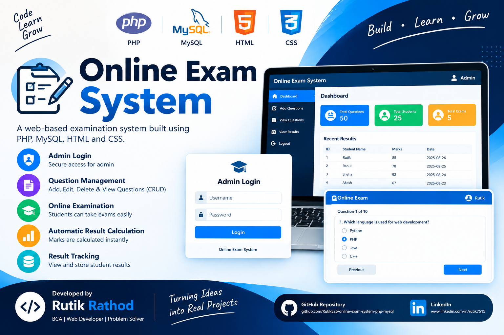

# Online Exam System



## 📌 Project Overview

Online Exam System is a web-based examination platform developed using PHP, MySQL, HTML, and CSS. It allows administrators to manage questions and students to take exams online with automatic result calculation.

## 🚀 Features

- Admin Login
- Add Questions
- Edit Questions
- Delete Questions
- View Questions
- Online Examination
- Automatic Result Calculation
- Student Result Storage
- View Exam Results
- MySQL Database Integration

## 🛠️ Technologies Used

- PHP
- MySQL
- HTML5
- CSS3
- XAMPP

## 📂 Project Files

- index.php
- login.php
- db.php
- add_question.php
- edit_question.php
- update_question.php
- delete_question.php
- view_questions.php
- exam.php
- submit_exam.php
- view_results.php
- style.css
- online_exam.sql

## 🗄️ Database Setup

1. Open phpMyAdmin
2. Create database:

```sql
online_exam
```

3. Import:

```text
online_exam.sql
```

## ▶️ How to Run

1. Install XAMPP
2. Start Apache and MySQL
3. Copy project to:

```text
C:\xampp\htdocs\online_exam_system
```

4. Import database
5. Open browser:

```text
http://localhost/online_exam_system
```

## 👨‍💻 Developer

**Rutik Rathod**

BCA Student | Web Developer

GitHub:
https://github.com/Rutik526

LinkedIn:
https://www.linkedin.com/in/rutik7515

---

### Project Highlights

✅ Admin Dashboard

✅ Question Management (CRUD)

✅ Online Exam Module

✅ Automatic Result Calculation

✅ Result Tracking System
